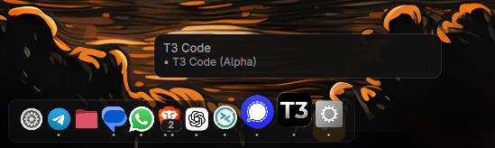
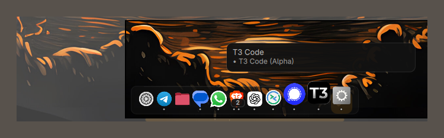

# Omadocked

A native dock for [Omarchy](https://omarchy.org): running apps, pins, folders, and custom launchers on every selected display.

Plugin id: `burmjohn.omadocked`.





## Features

- Bottom shelf on the displays you choose
- Wave or zoom magnification, or motion off
- Pins, running apps, folders, and optional names
- Hover window fan with still previews
- Settings for size, transparency, auto-hide, and outputs
- Custom launchers: apps, commands, links, and folders
- Click-to-minimize: active window, all windows, or off

Settings and pins are stored in `~/.config/omadocked/pins.json`.

## Requirements

- [Omarchy](https://omarchy.org) with Quickshell
- Hyprland
- `python3` and `python-gobject` for desktop-entry launches
- `xdg-terminal-exec` only if you use command-in-terminal items

Version is `0.1.1` in [`manifest.json`](manifest.json). See [CHANGELOG.md](CHANGELOG.md).

## Install

```sh
omarchy plugin add https://github.com/burmjohn/omadocked --enable
omarchy-launch-shell
```

That restarts the Omarchy shell only, not the session.

## Remove

```sh
omarchy plugin disable burmjohn.omadocked
```

Your `pins.json` is left in place until you delete it.

## Development

```sh
make preview          # standalone dock, no plugin install
make test             # spawn-safety guards
make test-offscreen   # offscreen Qt tests
make lint
```

## License

[MIT](LICENSE). Bugs and ideas: [issues](https://github.com/burmjohn/omadocked/issues).
